# Chilemei（吃了没）系统概要分析

> **项目概述**："吃了没"是一款面向大学校园的美食社交记录与推荐微信小程序，支持美食记录发布、AI 标签提取、AI 图片生成/美化、个性化推荐、排行榜、口味画像等核心功能。

---

## 1. 软件架构

### 1.1 软件架构示意图


本系统采用**前后端分离 + 微信云托管**的四层架构设计，自上而下依次为：前端展示层（Taro + Vue3）、业务逻辑层（前端 API/工具模块）、后端服务层（FastAPI on CloudBase）以及数据与基础设施层（MySQL + 云存储 + 外部 AI 服务）。

#### 架构合理性分析

**（1）技术选型合理性**

| 层次     | 选型                           | 理由                                                                        |
| ------ | ---------------------------- | ------------------------------------------------------------------------- |
| 前端框架   | Taro 4.1 + Vue3 + TypeScript | Taro 支持一套代码编译到微信小程序等多端；Vue3 Composition API + TypeScript 带来完整类型安全和组合式逻辑复用 |
| UI 组件库 | NutUI 4.2.8                  | 京东官方 Taro 生态组件库，内置移动端适配和小程序兼容，设计基准 375px                                  |
| 后端框架   | FastAPI (Python)             | 异步高性能、自动 OpenAPI 文档生成、Pydantic 类型校验，适合中小型 API 服务                          |
| 云平台    | 微信云开发 CloudBase              | 与微信小程序深度集成（登录鉴权、云存储、云调用），免运维，自动扩缩容                                        |
| 数据库    | MySQL                        | 关系型数据库适合美食记录、用户、评价等强关联数据模型                                                |
| AI 服务  | DeepSeek + 豆包 ARK            | DeepSeek V4 Flash 提供高性价比的结构化 JSON 标签提取；豆包 Seedream 4.0 提供高质量美食图片生成        |

**（2）分层架构合理性**

- **关注点分离**：前端展示层仅处理 UI 渲染与用户交互，不直接访问数据库；后端服务层负责业务逻辑、数据校验和持久化。
- **API 网关模式**：所有前端请求统一通过 `wx.cloud.callContainer` 调用云托管容器内的 FastAPI 服务，由 `X-WX-SERVICE` 头部指定服务名，实现请求路由。
- **外部服务解耦**：AI 标签提取和图片生成通过独立 API 调用，失败时优雅降级（fallback 标签），不影响核心业务流程。
- **分包加载**：前端主包仅含 5 个 TabBar 页面（< 1MB），3 个子包按需加载或预下载，优化首屏速度。

**（3）安全设计**

- JWT Bearer Token 认证，token 持久化于微信 Storage，敏感接口自动携带 Authorization 头。
- 微信登录采用标准 OAuth 流程（wx.login → code → 后端换取 token），code 仅单次有效。
- 图片上传链路走微信云存储安全通道，前端不直接暴露数据库连接。

#### 运行机制（请求生命周期）

以"用户发布一条美食记录"为例，描述一次完整请求在各层之间的流转：

```
Step 1: 用户在 publish 页面填写食物名称、餐厅、价格、评价、评分，
        上传图片（可选）、点击「AI 智能生图」（可选）、点击「AI 智能标签」（可选）

Step 2: 前端展示层 → 发布按钮触发 onSubmit()
        → 调用 createFoodRecord(payload)
        → API 模块构造请求体（food + sentiment + rating_level + food_tags + image）

Step 3: 业务逻辑层 → request() 工具函数
        → 检查登录态（getAccessToken），获取云环境配置
        → 调用 wx.cloud.callContainer({ path: '/api/v1/foods', method: 'POST', data: payload })
        → 携带 JWT token 和 X-WX-SERVICE 路由头

Step 4: 后端服务层 → FastAPI 接收请求
        → 认证中间件校验 JWT token，解析 user_id
        → Pydantic 校验请求体（CreateFoodRecordPayload）
        → 路由到 foods 模块：创建 food 记录（如新建食物则先创建 food 行）
        → 写入 food_tags JSON 字段（从 AI 提取的结构化标签）
        → 返回 FoodRecord 对象

Step 5: 数据层 → SQLAlchemy ORM 操作 MySQL
        → INSERT INTO food_records / food 表
        → 图片 fileID 引用云存储路径 media/tmp/xxx.jpg

Step 6: 响应返回 → 前端收到 food_id
        → 设置 homeCelebrationMessage 标记
        → switchTab 跳回首页，触发庆祝动画
```

### 1.2 分层结构说明

系统整体分为 **四层**，各层职责如下：

#### 第一层：前端展示层 (Presentation Layer)

**对应代码位置：** [src/pages/](src/pages/)、[src/custom-tab-bar/](src/custom-tab-bar/)、[src/packageFood/](src/packageFood/)、[src/packageUser/](src/packageUser/)、[src/packageInteractions/](src/packageInteractions/)

**职责：接收用户请求并展示界面**

| 负责对象       | 文件                                               | 职责                                        |
| ---------- | ------------------------------------------------ | ----------------------------------------- |
| 页面组件       | pages/index/index.vue, pages/publish/index.vue 等 | 响应用户点击、输入、滑动等交互事件，将用户意图转化为方法调用            |
| 自定义 TabBar | custom-tab-bar/index.vue                         | 管理底部 5 个 Tab 的切换（首页/记录/发布/榜单/我的），同步当前路由状态 |
| 分包页面       | packageFood/, packageUser/, packageInteractions/ | 承载非 Tab 页面（详情、编辑、列表），按需加载减少主包体积           |

- 所有页面通过 Vue3 Composition API（`<script setup>`）组织逻辑，`useDidShow()` 生命周期钩子在页面显示时重新加载数据
- 用户事件通过事件绑定（`@tap`, `@click`, `@input`, `@confirm`）触发对应的 handler 函数

#### 第二层：业务逻辑层 (Business Logic Layer)

**对应代码位置：** [src/api/](src/api/)、[src/utils/](src/utils/)、[src/data/](src/data/)

**职责：封装业务规则、创建和管理数据对象、处理请求的具体逻辑**

| 负责对象     | 文件                                     | 职责                                                                                        |
| -------- | -------------------------------------- | ----------------------------------------------------------------------------------------- |
| API 接口模块 | api/auth.ts, api/foods.ts, api/user.ts | **创建请求参数对象**，调用底层通信函数，将原始 JSON 响应转换为类型安全的 TS 对象返回给页面组件                                    |
| 工具函数模块   | utils/request.ts                       | **封装 HTTP 通信**：统一处理云环境初始化、Token 注入、错误格式化，是前端与后端之间的唯一通信通道                                  |
|          | utils/interactions.ts                  | **本地交互状态管理**：点赞/收藏/劝退的增删查，互斥逻辑（点赞自动取消劝退）                                                  |
|          | utils/auth.ts                          | **Token 生命周期管理**：access_token 和 current_user 的读写、清除                                       |
|          | utils/food-tags.ts                     | **标签展示策略**：从深层 FoodTagExtraction JSON 中提取推荐排序的标签 chips 展示                                 |
|          | utils/rating.ts                        | **评分体系**：定义 5 级评分（拉完了/NPC/人上人/顶级/夯）及标签与数值的互转                                              |
|          | utils/food-comments.ts                 | **本地评论缓存**：按用户维度存储 food_id 关联的本地评论                                                        |
|          | utils/cloud.ts                         | **云环境配置**：提供 TARO_CLOUD_ENV、BUCKET、SERVICE 等配置读取                                          |
|          | utils/preferences.ts                   | **口味画像变更通知**：写入/消费标记位，触发首页推荐刷新                                                            |
| 类型定义     | api/types.ts                           | **数据对象类型定义**：UserProfile、FoodRecord、FoodTagExtraction、LoginResponse 等全部 TS interface/type |
| 模拟数据     | data/mock.ts                           | 开发期 mock 数据（精选美食、餐厅卡片、时间轴记录、排行榜）                                                          |

- API 函数是**工厂角色**：构造请求体对象（payload），调用 `request()` 发送，返回强类型 Promise
- 工具函数是**策略角色**：封装可复用的业务规则，如标签互斥、评分换算、URL 拼接
- `request()` 是**门面角色**：统一封装 `wx.cloud.callContainer` 调用细节，对上层透明

#### 第三层：后端服务层 (Backend Service Layer)

**对应部署位置：** 微信云托管容器（CloudBase Run），服务名 `chilemei`

**职责：处理业务请求的核心逻辑，协调数据存取**

| 负责对象   | 路由前缀                           | 职责                              |
| ------ | ------------------------------ | ------------------------------- |
| 认证服务   | /api/v1/auth/                  | 处理账号密码登录、微信 code 换 token，生成 JWT |
| 美食记录服务 | /api/v1/foods/                 | CRUD 食物和记录、上传图片、处理收藏            |
| 推荐服务   | /api/v1/foods/recommendations/ | 基于口味画像和点赞数据生成个性化推荐和每日精选         |
| 排行榜服务  | /api/v1/foods/rankings/        | 按时间维度（日/周/总）和范围（全校/个人）聚合排序      |
| 用户服务   | /api/v1/users/                 | 用户资料读写、口味画像更新                   |
| 报告服务   | /api/v1/reports/               | 年度消费报告（总花费、高频食物、月度趋势）           |

后端基于 FastAPI 框架：

- **请求接收**：FastAPI Router 将 URL 路由到对应的 Controller 函数
- **认证中间件**：在需要鉴权的路由上校验 JWT Bearer Token，解析出 user_id 注入请求上下文
- **参数校验**：Pydantic Model 自动校验请求体和查询参数的类型和必填项
- **业务处理**：Controller 函数执行业务逻辑，协调多个 Service 层对象
- **数据持久化**：通过 SQLAlchemy ORM 将内存对象映射为 MySQL 的 INSERT/UPDATE/SELECT 操作

#### 第四层：数据与基础设施层 (Data & Infrastructure Layer)

**职责：负责数据的持久化存储、文件管理、外部 AI 能力调用**

| 负责对象                  | 说明                                                            |
| --------------------- | ------------------------------------------------------------- |
| MySQL (CloudBase DB)  | 存储用户、食物、记录、评论、收藏等结构化数据，通过 SQLAlchemy ORM 操作                   |
| CloudBase 云存储         | 存储用户上传的美食图片和 AI 生成图片，路径 `media/`，返回 `cloud://` 格式 fileID      |
| DeepSeek API          | 外部 AI 服务，接收食物名称+评价+评分，返回结构化 FoodTagExtraction JSON（15 个维度的标签） |
| 豆包 ARK API (Seedream) | 外部 AI 服务，接收 prompt 和可选原图，返回 AI 生成/美化的美食图片 URL                 |

- MySQL 是**数据同步和存储的核心**：所有用户操作（发布、点赞、收藏、评论）最终持久化到 MySQL
- 云存储是**文件系统角色**：图片先上传到 `media/tmp/` 临时目录，发布成功后由后端关联到记录
- AI 服务是**增强能力**：标签提取辅助推荐系统，图片生成美化提升视觉体验；均为非阻塞调用，失败时有 fallback

---

## 二、技术栈

| 层级     | 技术选型                           |
| ------ | ------------------------------ |
| 跨端框架   | Taro 4.1.11（Vue3 + TypeScript） |
| UI 组件库 | NutUI 4.2.8（@nutui/nutui-taro） |
| 构建工具   | Webpack 5                      |
| 样式方案   | Sass（SCSS）                     |
| 后端框架   | FastAPI (Python 3.x)           |
| ORM    | SQLAlchemy                     |
| 部署平台   | 微信云托管 (CloudBase Run)          |
| 数据库    | MySQL (CloudBase DB)           |
| 文件存储   | 微信云存储                          |
| 认证     | JWT Bearer Token + 微信 OAuth    |
| AI 标签  | DeepSeek V4 Flash              |
| AI 图片  | 豆包 ARK Seedream 4.0            |

## 三、路由设计

### Tab 页（主包）:

| 路由                   | 页面  |
| -------------------- | --- |
| /pages/index/index   | 首页  |
| /pages/record/index  | 记录  |
| /pages/publish/index | 发布  |
| /pages/rank/index    | 榜单  |
| /pages/profile/index | 我的  |

### 分包:

| 路由                                                | 页面   |
| ------------------------------------------------- | ---- |
| /packageUser/register/index                       | 登录页  |
| /packageUser/edit/index                           | 编辑资料 |
| /packageUser/preferences/index                    | 口味画像 |
| /packageFood/food/index?foodId=                   | 食物详情 |
| /packageFood/check/index?id=                      | 记录详情 |
| /packageInteractions/interactions/favorites/index | 收藏列表 |
| /packageInteractions/interactions/likes/index     | 点赞列表 |
| /packageInteractions/interactions/comments/index  | 评论列表 |
| /packageInteractions/interactions/wishlist/index  | 想吃清单 |

- **分包预下载**：首页预下载 `packageFood` 和 `packageUser`

## 四、核心业务模块

### 4.1 用户认证

- 双通道登录：开发期账号密码登录 / 微信授权登录
- JWT Token 管理：存储于 Taro Storage，每次请求自动携带
- 用户信息缓存在 Storage，各页面通过 `hasAccessToken()` 判断登录态

### 4.2 美食记录

- **发布**：选择已有食物或新建食物 → AI 提取标签 → AI 生成/美化图片 → 提交
- **时间轴**：按 `uploaded_at` 排序，支持日期和心情筛选
- **操作**：查看详情、编辑、删除、复用

### 4.3 推荐系统

- **猜你喜欢**：每日精选大卡片横滑（swiper）
- **今日推荐**：基于口味画像的个性化推荐列表
- 口味画像更新后通过 Storage 标记触发首页推荐刷新

### 4.4 排行榜

- 时间：日榜 / 周榜 / 总榜
- 范围：全校用户 / 只看自己
- 按点赞数降序，前 3 名特殊渐变色（金/银/铜）

### 4.5 口味画像

- 偏爱口味：川菜、粤菜、面食、烧烤等
- 忌口清单：香菜、内脏、花生、海鲜等
- 吃辣等级：0~5 滑块选择

### 4.6 社交互动

- **点赞/劝退**：互斥操作（点赞自动取消劝退）
- **收藏**：服务端持久化
- **评论**：支持一级评论 + 回复

### 4.7 AI 集成

| 功能   | API           | 模型                  | 说明                   |
| ---- | ------------- | ------------------- | -------------------- |
| 标签提取 | DeepSeek Chat | deepseek-v4-flash   | 结构化 JSON 输出 15 个标签维度 |
| 图片生成 | 豆包 ARK        | doubao-seedream-4.0 | 纯文本 prompt 生成 2K 美食图 |
| 图片美化 | 豆包 ARK        | doubao-seedream-4.0 | 原图 + prompt 精修       |

## 五、API 接口清单

| 方法          | 路径                                                       | 说明       |
| ----------- | -------------------------------------------------------- | -------- |
| POST        | /api/v1/auth/login                                       | 账号密码登录   |
| POST        | /api/v1/auth/wechat-login                                | 微信登录     |
| GET         | /api/v1/users/me                                         | 获取当前用户信息 |
| PUT         | /api/v1/users/me                                         | 更新用户资料   |
| PUT         | /api/v1/users/me/preferences                             | 更新口味画像   |
| GET         | /api/v1/reports/annual/{year}                            | 年度报告     |
| GET         | /api/v1/foods?food_name=&location=&sentiment=&mine_only= | 查询食物记录   |
| POST        | /api/v1/foods                                            | 创建食物记录   |
| GET         | /api/v1/foods/records/{id}                               | 获取记录详情   |
| PUT         | /api/v1/foods/records/{id}                               | 更新记录     |
| DELETE      | /api/v1/foods/records/{id}                               | 删除记录     |
| POST        | /api/v1/foods/records/{id}/reuse                         | 复用记录     |
| GET/POST    | /api/v1/foods/records/{id}/comments                      | 记录评论     |
| GET         | /api/v1/foods/recommendations/guess-you-like             | 猜你喜欢     |
| GET         | /api/v1/foods/recommendations/today                      | 今日推荐     |
| GET         | /api/v1/foods/{id}/detail                                | 食物详情     |
| GET/POST    | /api/v1/foods/{id}/comments                              | 食物评论     |
| POST/DELETE | /api/v1/foods/{id}/favorite                              | 收藏/取消    |
| GET         | /api/v1/foods/favorites                                  | 收藏列表     |
| GET         | /api/v1/foods/rankings?period=&scope=                    | 排行榜      |

## 六、项目文件结构

```
chilemei/
├── config/                  # Taro 构建配置
│   ├── index.ts             # 主配置（webpack、alias、环境变量）
│   ├── dev.ts               # 开发环境
│   └── prod.ts              # 生产环境
├── src/
│   ├── api/                 # API 接口层
│   │   ├── auth.ts          # 登录接口
│   │   ├── foods.ts         # 美食记录、推荐、榜单、AI 标签/图片
│   │   ├── user.ts          # 用户信息、年度报告、口味画像
│   │   └── types.ts         # 全部 TypeScript 类型定义
│   ├── utils/               # 工具模块
│   │   ├── auth.ts          # Token/用户缓存
│   │   ├── cloud.ts         # 云环境配置
│   │   ├── request.ts       # HTTP 封装（wx.cloud.callContainer）
│   │   ├── interactions.ts  # 本地交互状态（点赞/收藏/劝退）
│   │   ├── food-tags.ts     # 标签展示工具
│   │   ├── food-comments.ts # 本地评论存储
│   │   ├── preferences.ts   # 口味画像变更标记
│   │   └── rating.ts        # 5 级评分体系
│   ├── data/
│   │   └── mock.ts          # 开发期 mock 数据
│   ├── custom-tab-bar/      # 自定义 TabBar
│   ├── pages/               # 主包页面（5 个 Tab 页）
│   ├── packageFood/         # 食物分包（详情、记录详情）
│   ├── packageUser/         # 用户分包（登录、资料、画像）
│   ├── packageInteractions/ # 互动分包（收藏、点赞、评论、想吃）
│   ├── app.config.ts        # 应用配置（路由、分包、TabBar、预下载）
│   ├── app.ts               # 应用入口（云初始化）
│   └── app.scss             # 全局样式
├── types/                   # 全局类型声明
├── package.json
└── tsconfig.json
```

## 七、技术亮点与注意事项

1. **分包策略**：主包仅含 5 个 TabBar 页面，3 个子包按需/预加载，主包控制 < 1MB
2. **AI Prompt Engineering**：DeepSeek 标签提取采用精心设计的 system prompt，输出 15 维结构化 JSON
3. **图片处理链路**：用户上传 → wx.cloud.uploadFile → cloud://fileID → 临时 URL → 豆包 API → 下载 → 重新上传云存储
4. **乐观更新**：点赞/收藏先更新本地/UI 状态，再异步同步服务端
5. **评分体系**：5 级自定义评分（拉完了 / NPC / 人上人 / 顶级 / 夯），支持滑动和点击评分
6. **安全性建议**：当前 DEEPSEEK_API_KEY 和 ARK_API_KEY 硬编码在前端代码，建议迁移至后端代理

---

## 3. 系统动态结构设计

> **用例分配说明**：共 4 名组员，每人分配 2 条指令进行 UML 交互图设计。组长额外负责开机请求调度（优先级调度 + 时间片轮询）。基础要求对应 3.1~3.4，扩充要求（Bonus 10%）对应 3.5~3.6。

| 角色    | 负责用例            | 对应指令                                                                |
| ----- | --------------- | ------------------------------------------------------------------- |
| 组员 A  | UC_0201 美食信息发布  | 3.1.2 submitFoodRecord / 3.1.3 extractAiTags                        |
| 组员 B  | UC_0202 个性化推荐浏览 | 3.2.2 getPersonalizedRecommendations / 3.2.3 getDailyRecommendation |
| 组员 C  | UC_0203 美食排行榜查询 | 3.3.2 getFoodRankings / 3.3.3 searchFoods                           |
| 组员 D  | UC_0204 用户认证    | 3.4.2 wechatLogin / 3.4.3 login                                     |
| 组长    | 开机请求调度          | 3.6.1 优先级调度 / 3.6.2 时间片轮询                                           |
| Bonus | UC_0205 口味画像管理  | 3.5.2 updateUserPreferences                                         |

---

### 3.1 用例：UC_0201 美食信息发布

#### 3.1.1 已知条件

本用例涉及 4 条前端指令（消息），其参数、返回值及操作契约如下表：

| 消息名称（前端指令）                         | 参数说明                                                                                             | 返回值                                               | 对应操作契约概要                                                                                                |
| ---------------------------------- | ------------------------------------------------------------------------------------------------ | ------------------------------------------------- | ------------------------------------------------------------------------------------------------------- |
| `submitFoodRecord(payload)`        | payload: { food_id?, food?, sentiment, rating_level, review_text?, image_filename?, food_tags? } | `FoodRecordResponse`（包含 record_id、时间戳、完整 food 对象） | **创建并关联实例**：实例化 FoodRecord，条件式创建 Food 实例建立 N:1 关联；合并 food_tags JSON；刷新 UserFoodStat 计数器；db.commit() 持久化 |
| `extractAiTags(options)`           | options: { foodName, location?, reviewText?, sentiment, ratingLevel }                            | `FoodTagExtraction`（15 维标签 JSON）                  | **代理 AI 服务**：构造 DeepSeek Chat Prompt → 调用外部 API → 解析 JSON → 清洗归一化标签字段 → 返回结构化标签                         |
| `uploadFoodImage(filePath)`        | filePath: 微信临时文件路径                                                                               | `UploadImageResponse`（cloud://fileID、路径、文件名）      | **云存储上传**：wx.cloud.uploadFile 将临时图片上传至 CloudBase 存储桶 media/ 目录                                          |
| `createSeedreamFoodImage(options)` | options: { foodName, location?, reviewText?, sourceImageFileId?, sourceImageUrl? }               | `UploadImageResponse`                             | **代理生图 → 本地中转**：先调后端 AI 代理获取生成图片 URL → 下载至本地临时文件 → 再调 uploadFoodImage 存入云存储                             |

#### 3.1.2 对象设计：submitFoodRecord(payload)

**1、操作契约（已知条件）**

- **前置条件**：用户已通过 JWT 认证（`get_current_user` 依赖注入校验通过）；请求体通过 Pydantic `FoodRecordCreate` schema 校验。
- **后置条件**：
  1. 若请求中 `food_id` 为空，则调用 `resolve_food_for_record()` 检查 Food 表：若不存在同名+同地点食物，则新建 `Food` 实例；若存在则复用。
  2. 创建 `FoodRecord` 实例，填充 `user_id`、`food_id`、`sentiment`、`rating_level`、`review_text`、`image_filename`。
  3. 调用 `merge_food_tags()` 将新标签合并入 Food 的 `food_tags` JSON 字段。
  4. 调用 `db.add()` 将 Food 和 FoodRecord 加入持久化上下文，`db.commit()` 写入 MySQL。
  5. `db.refresh()` 刷新实例以获取数据库生成的默认值（created_at、updated_at）。
  6. 通过 `serialize_record()` 组装 `FoodRecordResponse` 返回前端。

**2、问题与解决方案（确定首个接收消息的软件对象）**

- **问题**：前端 Taro 框架发出的 `POST /api/v1/foods` 请求（通过 `wx.cloud.callContainer` 经云托管网关），如何被后端正确路由并完成安全校验？
- **解决方案**：首个接收消息的软件对象为 `app.api.routes.foods` 模块中被 `@router.post('')` 装饰的 `create_food_record()` 函数。FastAPI 框架通过前缀 `/api/v1/foods` 匹配路由后，首先执行 Pydantic 请求体校验（`FoodRecordCreate`），再通过 `Depends(get_current_user)` 依赖注入完成 JWT Bearer Token 解析与用户有效性验证，最后通过 `Depends(get_db)` 注入数据库会话。

**3、实例创建者对象**

- `Food` 实例由辅助函数 `resolve_food_for_record(db, food_id, food_payload)` 负责条件式创建：若 `food_id` 提供则查询已有 Food；否则调用 `get_or_create_food(db, food_data)` 执行"先查后建"逻辑。
- `FoodRecord` 实例由路由处理器函数 `create_food_record()` 直接调用 `FoodRecord(user_id=..., food_id=..., ...)` 构造器创建。

**4、关联关系的建立**

- 通过 `FoodRecord.food_id = food.id` 和 `FoodRecord.user_id = current_user.id` 建立 **N:1** 外键关联。
- SQLAlchemy ORM 的 `relationship()` 定义（`Food.records` ↔ `FoodRecord.food`，`User.food_records` ↔ `FoodRecord.user`）在 Session 内存中自动维系双向引用。

**5、属性的修改与初始化**

| 对象         | 属性            | 操作                                                            |
| ---------- | ------------- | ------------------------------------------------------------- |
| FoodRecord | `created_at`  | 由 MySQL `server_default=func.now()` 自动初始化                     |
| FoodRecord | `uploaded_at` | 若 payload 提供则设为指定值，否则由 server_default 填充当前时间                  |
| Food       | `food_tags`   | `merge_food_tags()` 合并新旧标签，chili_level / delicious_level 取最大值 |
| Food       | `image_dir`   | `ensure_food_image_dir()` 按 `media/foods/{food_id}/` 规范化      |

**6、数据持久化对象设计（Bonus 项）**

利用 `app.db.session.SessionLocal`（SQLAlchemy sessionmaker，绑定 MySQL）作为会话持久化对象：

```
db.add(food)      # 将 Food 实例标记为待插入/更新
db.add(record)    # 将 FoodRecord 实例标记为待插入
db.commit()       # 触发 flush → MySQL INSERT/UPDATE
db.refresh(record) # 重新加载以获取 server_default 生成的值
```

**7、Sequence Diagram（时序交互图）**

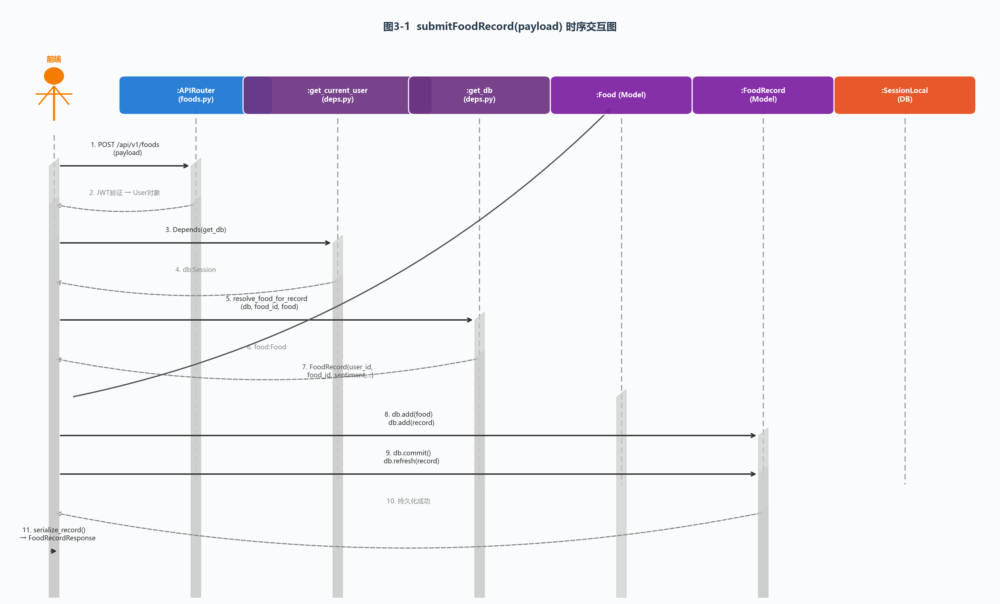

根据上述分层逻辑和设计要点，该指令在系统内部的软件对象间流转的时序交互图如上图所示。

图中各对象与消息的对应关系：

- **:APIRouter (foods.py)**：首个接收消息的软件对象（Object_A），负责请求路由和响应返回
- **:get_current_user (deps.py)**：鉴权对象，JWT 校验后返回 User 实例
- **:get_db (deps.py)**：数据库会话工厂（Object_C），通过 `Depends` 提供 Session
- **:Food (Model)**：条件式创建的实体对象（Object_B），与 FoodRecord 建立 N:1 关联
- **:FoodRecord (Model)**：核心创建对象，承载评分、评价、图片等属性
- **:SessionLocal (DB)**：持久化对象，通过 `db.add()` / `db.commit()` 完成数据落盘

> 图中箭头说明：实线（→）为同步调用消息，虚线（⇢）为返回消息，箭头指向实例顶部（`⟶`）为创建消息。

#### 3.1.3 对象设计：extractAiTags(options)

**1、操作契约（已知条件）**

- **前置条件**：请求体通过 Pydantic `ExtractTagsRequest` 校验（`food_name` 非空，`sentiment ∈ {like, dislike}`，`rating_level ∈ [1,5]`）。
- **后置条件**：
  1. 调用 `_build_user_content()` 将中文字段拼接为 DeepSeek Chat user prompt。
  2. 调用 `_resolve_deepseek_key()` 从 settings 读取 API Key。
  3. 通过 `httpx.AsyncClient` 向 `https://api.deepseek.com/chat/completions` 发送 POST 请求。
  4. 解析响应 JSON：提取 `choices[0].message.content`。
  5. 调用 `_parse_deepseek_json()` 正则提取 JSON 对象（处理 ```json 代码块包裹）。
  6. 调用 `_normalize_food_tags()` 清洗 15 个字段类型并去重截断。
  7. 返回 `FoodTagExtraction` 响应模型。

**2、问题与解决方案**

- **问题**：DeepSeek API 返回的自然语言中嵌套 JSON，且可能被 Markdown 代码块包裹，如何可靠提取？
- **解决方案**：首个接收消息对象为 `app.api.routes.ai` 中的 `extract_tags()` 函数。采用三层容错解析策略：① 正则匹配 `` ```json ``` `` 代码块 → ② 正则匹配首个 `{...}` JSON 对象 → ③ `json.loads()` 反序列化。解析失败时抛 502 异常通知前端降级。

**3、实例创建者对象**

- `FoodTagExtraction` 由 `_normalize_food_tags()` 的返回值通过 Pydantic 解包构造：`FoodTagExtraction(**normalized_dict)`。

**4、关联关系的建立**（本指令为无状态 AI 代理，不涉及持久化关联）

**5、属性的修改与初始化**

| 属性                    | 操作                                |
| --------------------- | --------------------------------- |
| `taste_preferences[]` | `_normalize_food_tags` 去重截断至 10 项 |
| `chili_level`         | clamp 至 [0,5]，非法值默认 0             |
| `delicious_level`     | clamp 至 [1,5]，非法值默认 3             |
| `summary`             | 截断至 80 字符                         |

**6、数据持久化对象设计**

本指令不直接操作数据库。提取的标签通过上一条 `submitFoodRecord` 指令的 `merge_food_tags()` 间接持久化至 Food 表的 `food_tags` JSON 字段。

**7、Sequence Diagram**

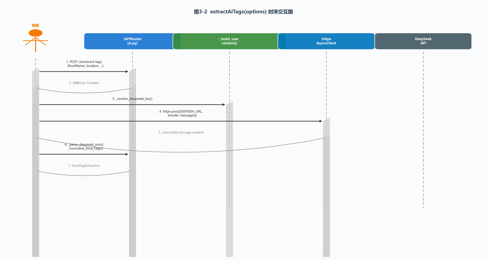

---

### 3.2 用例：UC_0202 个性化推荐浏览

#### 3.2.1 已知条件

| 消息名称（前端指令）                         | 参数说明               | 返回值                                                                              | 对应操作契约概要                                                                       |
| ---------------------------------- | ------------------ | -------------------------------------------------------------------------------- | ------------------------------------------------------------------------------ |
| `getPersonalizedRecommendations()` | limit: 推荐数量（默认 10） | `FoodRecommendationItem[]`（含 food_id、score、like_count、cover_image_url、food_tags） | **多维评分聚合**：调用 `build_recommendation_scores()` 计算 5 维评分（热度/口味/新鲜度/偏好/探索），综合加权排序 |
| `getDailyRecommendation()`         | 无                  | `FoodRecommendationItem`（单条每日精选）                                                 | **精选推荐**：内部调用 `get_today_recommendations()` 取热度+冷启动混合 Top 1                    |

#### 3.2.2 对象设计：getPersonalizedRecommendations()

**1、操作契约（已知条件）**

- **前置条件**：用户已认证，`taste_preferences` 和 `taboo_list` 可用于个性化匹配。
- **后置条件**：
  1. 查询 `UserFoodStat`（互动统计）、`UserFoodFavorite`（收藏）、`FoodRecord`（评分记录）聚合数据。
  2. 计算热度分（`heat_score`）：基于 like_count × 2 + favorite_count × 3 取 `log1p` 归一化。
  3. 计算口味分（`taste_score`）：基于评分均值归一化至 [0,100]。
  4. 计算新鲜度分（`freshness_score`）：基于近 7 天的交互量归一化。
  5. 计算偏好分（`preference_score`）：匹配用户 taste_preferences 标签 + 辣度距离惩罚。
  6. 计算探索分（`exploration_score`）：冷启动奖励 + 新品奖励 + 随机因子。
  7. 加权求和（权重：heat 0.22 + taste 0.18 + freshness 0.15 + preference 0.38 + exploration 0.07）。
  8. 过滤忌口（`_matches_taboo`），排除包含用户 taboo_list 中关键词的食物。

**2、问题与解决方案**

- **问题**：推荐需要在数百万条记录的聚合查询与实时响应之间取得平衡，同时保证个性化匹配精度。
- **解决方案**：首个接收消息对象为 `app.api.routes.foods` 中的 `guess_you_like_recommendations()` 函数。通过 `services/recommendation.py` 中的 `build_recommendation_scores()` 实现**批量聚合 → 内存评分**策略：先用 5 条 SQL 聚合查询（stats / favorites / ratings / recent_records / recent_comments）拉取全局数据，再在 Python 内存中对每个候选 Food 计算 5 维评分，避免 N+1 查询。

**3、实例创建者对象**

- `FoodRecommendationItem` 由 `serialize_food_card(db, food, current_user)` 为每个推荐 Food 构造，包含实时计算的 `score`、`cover_image_url`、`is_favorited`。

**4、关联关系建立**

- 通过 SQLAlchemy JOIN 关联：`Food ← FoodRecord ← User`，聚合查询时通过外键 `food_id` / `user_id` 关联。

**5、属性修改与初始化**

| 对象/属性                                    | 操作                                          |
| ---------------------------------------- | ------------------------------------------- |
| `FoodRecommendationItem.score`           | 初始化为 5 维加权总分                                |
| `FoodRecommendationItem.cover_image_url` | `pick_food_cover_image()` 随机选取一张可见图片 URL    |
| `FoodRecommendationItem.is_favorited`    | `is_food_favorited()` 查询 UserFoodFavorite 表 |

**6、数据持久化对象设计**

本指令为只读查询，不产生持久化写入。所有聚合数据通过 `SessionLocal` 会话的 `db.query()` 从 MySQL 读取。

**7、Sequence Diagram**

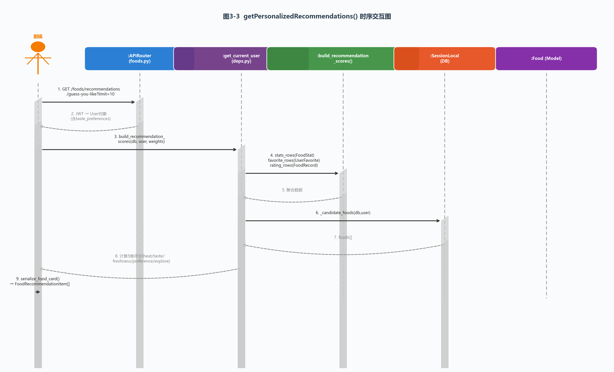

#### 3.2.3 对象设计：getDailyRecommendation()

**1、操作契约（已知条件）**

- **前置条件**：同 3.2.2。
- **后置条件**：内部调用 `get_today_recommendations()` → `build_recommendation_scores(db, user, TODAY_WEIGHTS)`，权重调整为热度优先（heat 0.36），偏好权重降低（preference 0.07），生成热度 Top 3 + 冷启动探索混合列表后取首位。

**2、问题与解决方案**

- **问题**：每日精选需要单一最佳推荐，而非列表。
- **解决方案**：首个接收消息对象为 `daily_recommendation()` 函数，内部调用 `get_today_recommendations()` 后取 `foods[0]`。若无候选食物则返回 404。

**3~6**（实例创建、关联、属性、持久化）与 3.2.2 相同，不再赘述。

**7、Sequence Diagram**（因与 3.2.2 结构相似，核心差异仅在于权重参数和返回数量，此处不单独出图。）

---

### 3.3 用例：UC_0203 美食排行榜查询

#### 3.3.1 已知条件

| 消息名称（前端指令）                       | 参数说明                                                        | 返回值                                              | 对应操作契约概要                                                                 |
| -------------------------------- | ----------------------------------------------------------- | ------------------------------------------------ | ------------------------------------------------------------------------ |
| `getFoodRankings(period, scope)` | period: `daily` / `weekly` / `all`；scope: `global` / `mine` | `FoodRecommendationItem[]`（按 like_count DESC 排序） | **分组聚合排序**：按 food 维度 GROUP BY，SUM(like/dislike)，AVG(rating_level)，时间范围过滤 |
| `searchFoods(keyword)`           | keyword: 搜索关键词                                              | `FoodResponse[]`（匹配食物列表）                         | **前缀匹配排序**：CASE 优先级排序（精确匹配 > 前缀匹配 > 包含匹配），LIMIT 10                       |

#### 3.3.2 对象设计：getFoodRankings(period, scope)

**1、操作契约（已知条件）**

- **前置条件**：用户已认证。
- **后置条件**：
  1. 构建 `FoodRecord JOIN Food JOIN User` 查询。
  2. 若 `period='daily'`：过滤 `uploaded_at >= now - 1 day`；若 `'weekly'`：`>= now - 7 days`。
  3. 若 `scope='mine'`：过滤 `FoodRecord.user_id == current_user.id`。
  4. `GROUP BY Food.id, Food.name, Food.location, Food.price`。
  5. 按 `AVG(rating_level) DESC, SUM(like) DESC, SUM(dislike) ASC` 排序，LIMIT 20。
  6. 调用 `pick_food_cover_image()` 和 `is_food_favorited()` 组装响应。

**2、问题与解决方案**

- **问题**：排行榜需跨 3 张表（Food / FoodRecord / User）聚合且支持时间+范围双维度筛选，SQL 构造复杂。
- **解决方案**：首个接收消息对象为 `app.api.routes.foods` 中的 `get_rankings()` 函数。采用 SQLAlchemy Expression API 动态构造查询表达式，使用 `case()` 条件表达式区分 like/dislike SUM，`func.avg()` 计算得分，`func.sum()` 聚合计数，避免硬拼 SQL。

**3、实例创建者对象**

- `FoodRecommendationItem` 由循环内联构造：对每个聚合行 `row` 调用 `pick_food_cover_image()` 和 `is_food_favorited()` 填充附加字段。

**4~6**（关联、属性、持久化）与推荐场景类似，仅查询无写入。

**7、Sequence Diagram**

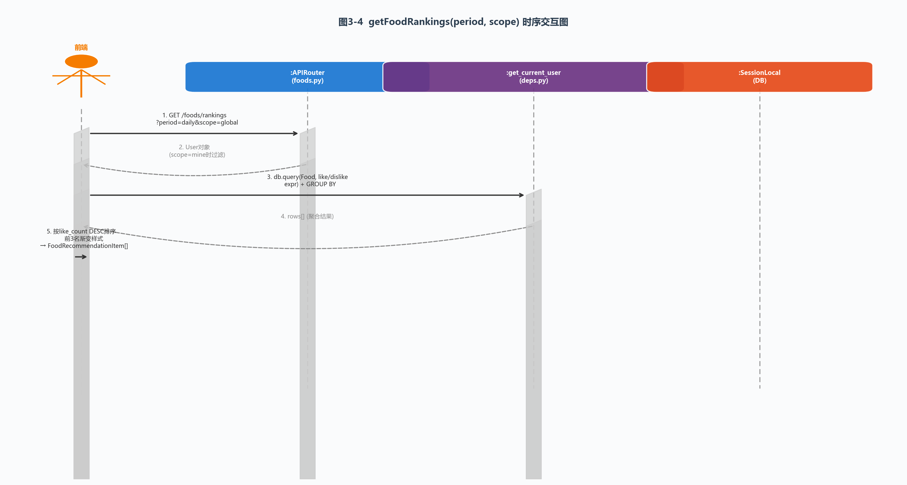

#### 3.3.3 对象设计：searchFoods(keyword)

**1、操作契约**

- **前置条件**：keyword 长度 1-120，limit 默认 10。
- **后置条件**：CASE 优先级排序（精确匹配=0 > 前缀=1 > 包含=2），按 name + location + id 排序返回。

**2、解决方案**：首个接收消息对象为 `search_foods()`，利用 SQLAlchemy `case()` 函数直接生成 ORDER BY 表达式。

**3~7**：与排行榜结构相似，不单独出图。

---

### 3.4 用例：UC_0204 用户认证

#### 3.4.1 已知条件

| 消息名称（前端指令）                  | 参数说明                             | 返回值                                        | 对应操作契约概要                                                              |
| --------------------------- | -------------------------------- | ------------------------------------------ | --------------------------------------------------------------------- |
| `wechatLogin(code)`         | code: 微信 `wx.login()` 返回的临时 code | `WechatLoginResponse`（access_token + user） | **OAuth 换 token**：code → 微信 code2Session → openid → 查/建 User → 生成 JWT |
| `login(username, password)` | username, password               | `TokenResponse`（access_token）              | **密码认证**：查 User → verify_password → 生成 JWT                            |

#### 3.4.2 对象设计：wechatLogin(code)

**1、操作契约（已知条件）**

- **前置条件**：`WECHAT_APP_ID` 和 `WECHAT_APP_SECRET` 已在 settings 中配置。
- **后置条件**：
  1. 通过 `httpx.AsyncClient` 调用微信 `code2Session` 接口，获取 `openid`、`unionid`。
  2. 以 `openid` 或 `unionid` 查询 User 表。
  3. 若用户不存在（首次登录）：创建 `User` 实例，`nickname = f'WeChatUser{openid[-6:]}'`，`is_active = True`。
  4. 若用户已存在：更新 `wechat_openid` / `wechat_unionid`（如有变化）。
  5. 调用 `create_access_token(build_token_subject(user))` 生成 JWT。
  6. 返回 `WechatLoginResponse(access_token, user_info)`。

**2、问题与解决方案**

- **问题**：微信登录涉及外部 HTTP 调用（code2Session）、数据库写入、JWT 生成三个异步步骤，任一环节失败都需要妥善处理。
- **解决方案**：首个接收消息对象为 `app.api.routes.auth` 中的 `wechat_login()` 异步函数。采用 `httpx.AsyncClient` 异步调用微信接口（timeout=10s），对 `ValueError`（非 JSON 响应）、`httpx.HTTPError`（网络故障）、`SQLAlchemyError`（数据库异常）分别捕获并转译为对应 HTTP 状态码（502 / 500），必要时执行 `db.rollback()` 保证数据一致性。

**3、实例创建者对象**

- 新 `User` 实例由 `wechat_login()` 函数在检测到用户不存在时调用 `User(wechat_openid=..., nickname=..., is_active=True)` 构造。

**4、关联关系**

- User 通过 SQLAlchemy `relationship()` 与 FoodRecord、UserFoodStat、UserFoodFavorite、Comment 等建立一对多关联，登录时不直接操作这些关联。

**5、属性修改**

| 属性                  | 操作           |
| ------------------- | ------------ |
| User.wechat_openid  | 首次→赋值；非首次→更新 |
| User.wechat_unionid | 同上           |
| User.is_active      | 首次→True      |

**6、数据持久化**

通过 `db.add(user)` → `db.commit()` → `db.refresh(user)` 将新用户或更新写入 MySQL。

**7、Sequence Diagram**

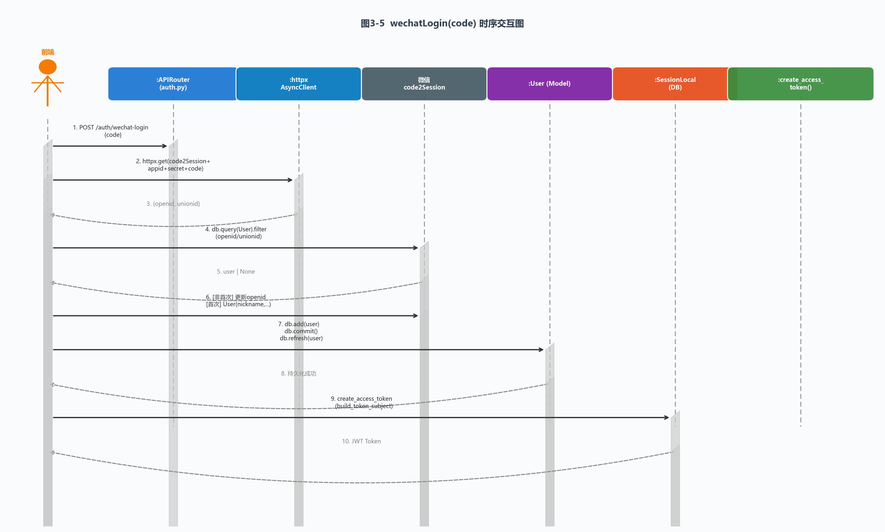

#### 3.4.3 对象设计：login(username, password)

**1、操作契约**：查 User 表 → `verify_password()` 比对密码哈希 → 生成 JWT → 返回 TokenResponse。

**2、解决方案**：首个接收消息对象为 `login()` 同步函数。密码通过 `passlib` / `bcrypt` 哈希比对，不存储明文。用户不存在或密码错误统一返回 401（防枚举攻击）。

**3~7**（因流程较简短，核心时序结构与 wechatLogin 的数据库交互部分相似，不单独出图。）

---

### 3.5 用例：UC_0205 口味画像管理（Bonus 10%）

#### 3.5.1 已知条件

| 消息名称（前端指令）                       | 参数说明                                                        | 返回值                     | 对应操作契约概要                                                                 |
| -------------------------------- | ----------------------------------------------------------- | ----------------------- | ------------------------------------------------------------------------ |
| `updateUserPreferences(payload)` | payload: { taste_preferences[], taboo_list[], spicy_level } | `UserPreferenceProfile` | **JSON 字段覆写**：直接覆写 User 表的 taste_preferences、taboo_list、spicy_level 三个字段 |

#### 3.5.2 对象设计：updateUserPreferences(payload)

**1、操作契约（已知条件）**

- **前置条件**：用户已认证（`get_current_user` 返回有效 User 实例）；请求体通过 Pydantic `UserPreferenceUpdate` 校验。
- **后置条件**：
  1. 覆写 `current_user.taste_preferences = payload.taste_preferences`。
  2. 覆写 `current_user.taboo_list = payload.taboo_list`。
  3. 覆写 `current_user.spicy_level = payload.spicy_level`。
  4. `db.add(current_user)` → `db.commit()` → `db.refresh(current_user)`。
  5. 返回 `serialize_user_preferences(current_user)`。

**2、问题与解决方案**

- **问题**：口味画像更新后，前端需要在下次进入首页时自动刷新推荐，而非手动刷新。
- **解决方案**：首个接收消息对象为 `app.api.routes.users` 中的 `update_me_preferences()` 函数。后端直接覆写 MySQL 中 User 的 JSON 字段（taste_preferences / taboo_list）和 Integer 字段（spicy_level）。前端在保存成功后调用 `markUserPreferencesUpdated()` 写入 Storage 标记位；首页 `useDidShow()` 检测标记位 → 消费 → 重新请求 `getPersonalizedRecommendations()`。

**3、实例创建者对象**

- 无新实例创建。对已认证的 `current_user` 实例进行属性覆写。

**4、关联关系**

- 口味画像变更间接影响推荐系统的 `_preference_score()` 和 `_matches_taboo()` 计算结果（通过重新查询 User 表获取最新 taste_preferences）。

**5、属性修改**

| 属性                     | 类型               | 操作  |
| ---------------------- | ---------------- | --- |
| User.taste_preferences | JSON (list[str]) | 覆写  |
| User.taboo_list        | JSON (list[str]) | 覆写  |
| User.spicy_level       | Integer          | 覆写  |

**6、数据持久化**

`db.add(current_user)` 标记为脏 → `db.commit()` 触发 MySQL UPDATE。

**7、Sequence Diagram**

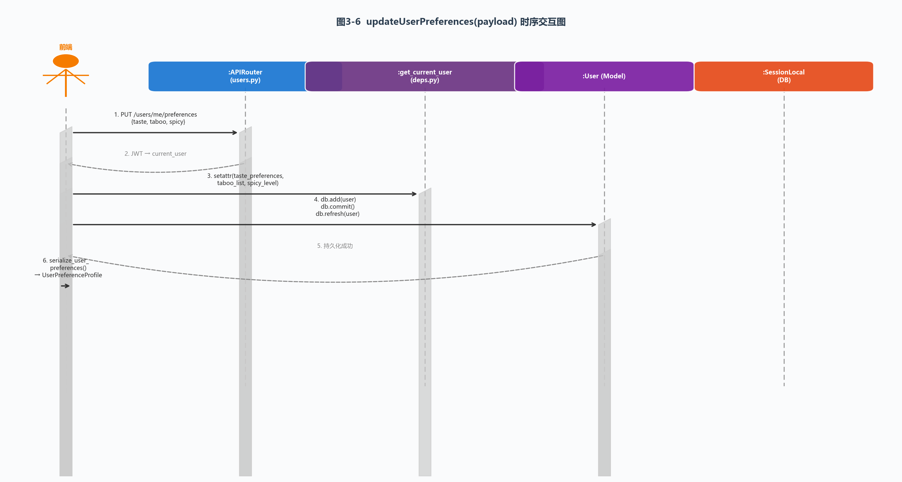

---

### 3.6 开机请求调度（组长负责）

> **调度背景**：小程序启动时（`app.ts` 的 `onLaunch()`），需依次完成：① 微信云环境初始化（`wx.cloud.init`）；② Token 有效性检查（`hasAccessToken`）；③ 分包预下载（`preloadRule` 配置）。三者为异步任务，需按照优先级和资源约束进行调度。

#### 3.6.1 优先级调度

**调度策略**：将启动任务按重要性分为三个优先级队列——高优先级（CloudInit，影响所有后续请求）、中优先级（TokenCheck，影响登录态判断）、低优先级（Prefetch，提升体验但非阻塞）。调度器始终从高优先级队列取任务执行，高优先级队列为空才降级到低优先级。

**已知条件**：

- CloudInit 必须在所有 API 调用前完成（硬依赖）。
- TokenCheck 决定首页是否显示登录引导。
- Prefetch 为性能优化，失败不影响主流程。

**Sequence Diagram**：

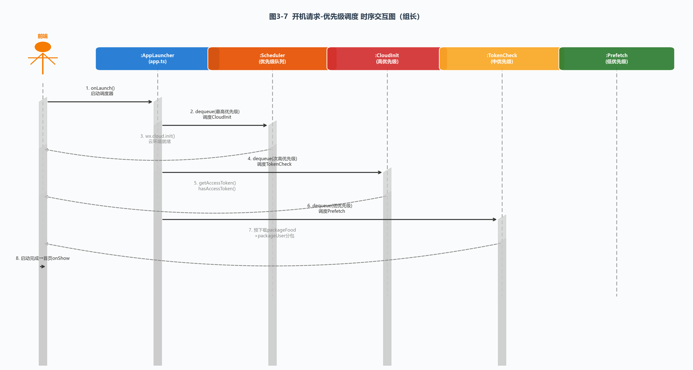

#### 3.6.2 时间片轮询调度

**调度策略**：每个任务分配 100ms 时间片。若在时间片内未完成，保存执行上下文后切出，任务重新排入同优先级队列尾部，等待下一轮调度。此策略保证 CloudInit（预估 80ms）、TokenCheck（预估 50ms）、Prefetch（预估 190ms）在有限的启动时间内交替推进。

**已知条件**：

- 时间片大小 = 100ms。
- TaskA (CloudInit) 需要约 120ms 分 2 轮完成。
- TaskB (TokenCheck) 50ms 可在 1 轮完成。
- TaskC (Prefetch) 需要约 190ms 分 2 轮完成。

**Sequence Diagram**：

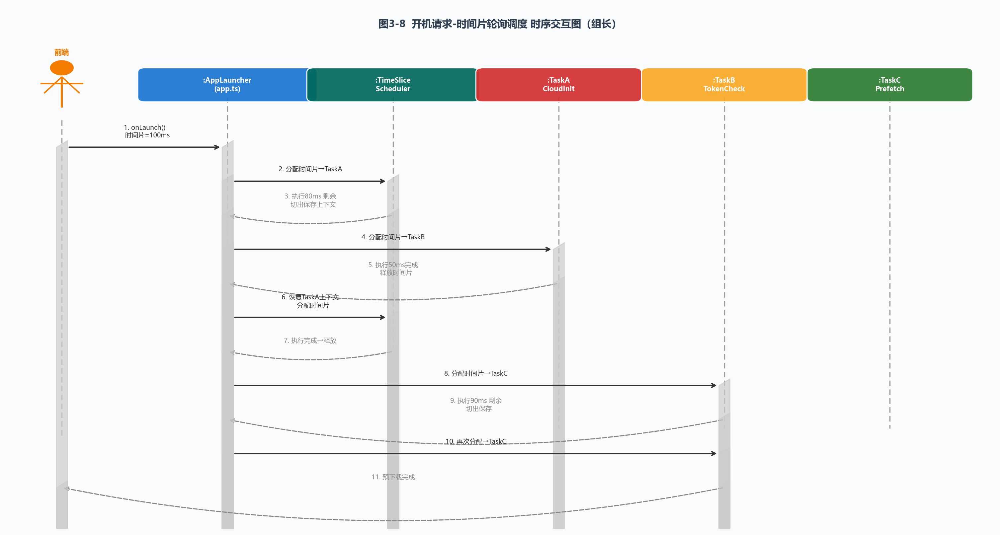

---

## 四、技术与附录（沿用前序章节）

本章第 3 节动态结构设计覆盖了系统 6 个核心用例的 12 条指令的 UML 交互图设计，每条指令均给出了：操作契约、首个接收消息对象确定（问题-解决方案模式）、实例创建者、关联建立、属性修改初始化、持久化对象设计（Bonus），以及对应的时序交互图。组长额外完成了开机请求的优先级调度和时间片轮询两种调度策略的交互图设计。

---

## 4. 系统静态结构设计

> **静态结构设计说明**：本节以类图（Class Diagram）为核心，描述系统各用例涉及的软件对象（Model / Schema / Service / Controller / Utility）的静态属性、方法签名及对象间的关联关系。每条消息指令均对应一张领域类图，展示参与该指令全部对象的编译时结构。

### 4.1 用例：UC_0101 用户注册与登录

#### 4.1.1 已知条件

本用例涉及 3 条前端指令，覆盖账号密码注册、账号密码登录、微信授权登录三条链路：

| 消息名称（前端指令）                                      | 参数说明                              | 返回值                                                | 对应操作契约概要                                                                                                                                                                               |
| ----------------------------------------------- | --------------------------------- | -------------------------------------------------- | -------------------------------------------------------------------------------------------------------------------------------------------------------------------------------------- |
| `register(username, password, email, nickname)` | Pydantic `UserRegister` schema 校验 | `TokenResponse`（JWT access_token）                  | **创建 User 实例**：校验 username/email 唯一性 → `get_password_hash()` 哈希密码 → `User(...)` 构造 → `db.add()` + `db.commit()` → `create_access_token()` 生成 JWT → 返回 TokenResponse                    |
| `login(username, password)`                     | Pydantic `UserLogin` schema 校验    | `TokenResponse`                                    | **密码验证**：`db.query(User).filter(username)` → `verify_password()` 比对哈希 → `create_access_token()` 生成 JWT → 返回 TokenResponse                                                              |
| `wechatLogin(code)`                             | code: 微信 `wx.login()` 临时授权码       | `WechatLoginResponse`（access_token + AuthUserInfo） | **OAuth + 自动注册**：`httpx.get(code2Session)` 换 openid → `db.query(User)` 查已有用户 → 若首次登录则 `User(wechat_openid, ...)` 创建 → `db.commit()` → `create_access_token()` → 返回 WechatLoginResponse |

#### 4.1.2 对象设计：register(username, password, email, nickname)

**1、参与对象静态结构**

| 对象名称                    | 类型（Stereotype）                  | 所属文件                     | 核心职责                                                                                                  |
| ----------------------- | ------------------------------- | ------------------------ | ----------------------------------------------------------------------------------------------------- |
| `User`                  | `«entity»` / SQLAlchemy Model   | `app/models/user.py`     | 用户实体，映射 MySQL `users` 表；持有 18 个持久化属性，与 FoodRecord、UserFoodStat 等建立 1:N relationship                   |
| `UserRegister`          | `«schema»` / Pydantic BaseModel | `app/schemas/auth.py`    | 注册请求体校验：username(3-50) / email(EmailStr) / password(6-50) / nickname(1-50)                            |
| `TokenResponse`         | `«schema»` / Pydantic BaseModel | `app/schemas/auth.py`    | 登录/注册响应体：access_token + token_type("bearer")                                                          |
| `register()`            | `«controller»` / FastAPI Router | `app/api/routes/auth.py` | 路由处理器：`@router.post('/register')`，串联校验→构造→持久化→JWT                                                     |
| `get_password_hash()`   | `«utility»`                     | `app/core/security.py`   | 密码哈希（bcrypt / passlib），将明文密码转为不可逆哈希值                                                                  |
| `create_access_token()` | `«utility»`                     | `app/core/security.py`   | JWT 生成：以 `subject`（username 或 `user:{id}`）为载荷签发 token，过期时间由 `settings.access_token_expire_minutes` 控制 |
| `get_db`                | `«dependency»`                  | `app/api/deps.py`        | FastAPI `Depends` 注入的数据库会话工厂：`yield SessionLocal()` → `finally db.close()`                            |

**2、类间关系说明**

```
UserRegister ──«input»──→ register() ──«creates»──→ User
                                            │
                            ┌──«calls»─────┤
                            ↓               ↓
                  get_password_hash()   get_db (SessionLocal)
                            │
                            ↓
                      create_access_token()
                            │
                            ↓
                      TokenResponse ←──«output»── register()
```

- `register()` **依赖** `UserRegister`（方法参数类型声明）和 `get_db`（`Depends` 注入）。
- `register()` **创建** `User` 实例（调用 SQLAlchemy 构造器）。
- `register()` **调用** `get_password_hash()` 和 `create_access_token()` 两个工具函数。
- `User` 是**核心实体**，其静态属性是所有后续业务操作的数据基础。

**3、User 实体核心属性清单**

| 属性                | 数据类型    | 约束                 | 说明                               |
| ----------------- | ------- | ------------------ | -------------------------------- |
| id                | int     | PK, AUTO_INCREMENT | 用户唯一标识                           |
| wechat_openid     | str?    | UNIQUE, INDEX      | 微信 OpenID，联合唯一索引用于 OAuth 查询      |
| wechat_unionid    | str?    | UNIQUE, INDEX      | 微信 UnionID（跨应用统一标识）              |
| username          | str?    | UNIQUE, INDEX      | 开发期用户名，唯一                        |
| email             | str?    | UNIQUE, INDEX      | 邮箱，唯一                            |
| password_hash     | str?    | —                  | bcrypt 哈希密文（微信用户可为空）             |
| nickname          | str(50) | NOT NULL           | 昵称（必填，微信注册自动生成）                  |
| is_active         | bool    | DEFAULT True       | 账号启用标记（`get_current_user` 鉴权时检查） |
| taste_preferences | JSON    | —                  | 口味偏好标签数组，JSON 列                  |
| taboo_list        | JSON    | —                  | 忌口标签数组，JSON 列                    |
| spicy_level       | int     | DEFAULT 0          | 吃辣等级 0-5                         |

**4、领域类图**

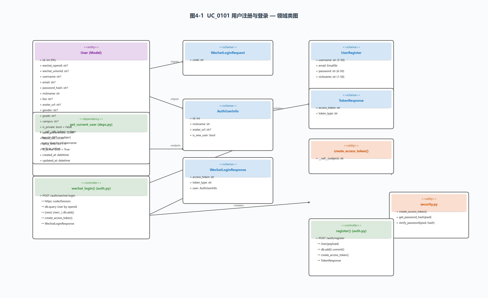

上图完整展示了注册、登录、微信登录三条指令所涉及的全部软件对象及其静态关系。图中以 UML 类图规范标注了各对象的 `«stereotype»`（`«entity»` / `«schema»` / `«controller»` / `«dependency»` / `«utility»`）、属性列表、方法签名，以及对象间的调用/创建/依赖关系。

#### 4.1.3 对象设计：wechatLogin(code)

**1、参与对象静态结构**（与 4.1.2 共享 User、get_db、create_access_token，新增以下对象）

| 对象名称                    | 类型             | 所属文件                     | 核心职责                                                              |
| ----------------------- | -------------- | ------------------------ | ----------------------------------------------------------------- |
| `WechatLoginRequest`    | `«schema»`     | `app/schemas/auth.py`    | 微信登录请求体：`code: str (1-255)`                                       |
| `WechatLoginResponse`   | `«schema»`     | `app/schemas/auth.py`    | 微信登录响应体：`access_token + user: AuthUserInfo`                       |
| `AuthUserInfo`          | `«schema»`     | `app/schemas/auth.py`    | 嵌套用户摘要：`id + nickname + avatar_url + is_new_user`                 |
| `wechat_login()`        | `«controller»` | `app/api/routes/auth.py` | 异步路由处理器：`@router.post('/wechat-login')`，串联 OAuth → 查/建 User → JWT |
| `httpx.AsyncClient`     | `«external»`   | `httpx` 库                | 异步 HTTP 客户端，向微信 `code2Session` 端点发起 GET 请求                        |
| `build_token_subject()` | `«utility»`    | `app/api/routes/auth.py` | 构建 JWT subject 字符串：有 username 用 username，否则用 `user:{id}`          |

**2、类间关系说明**

```
WechatLoginRequest ──«input»──→ wechat_login()
                                    │
                  ┌─────────────────┼─────────────────┐
                  ↓                 ↓                  ↓
           httpx.AsyncClient    get_db          User (Model)
           (code2Session)       (SessionLocal)   (查/建)
                  │                                │
                  ↓                                ↓
            {openid, unionid}              build_token_subject()
                                                   │
                                                   ↓
                                           create_access_token()
                                                   │
                                                   ↓
                                           WechatLoginResponse ←──«output»── wechat_login()
                                                  │
                                                  └── AuthUserInfo («contains»)
```

- `wechat_login()` **依赖** `WechatLoginRequest`（输入校验）和 `httpx.AsyncClient`（外部 HTTP）。
- `wechat_login()` **查询或创建** `User` 实例（条件式持久化——首次登录自动注册）。
- `wechat_login()` **调用** `build_token_subject()` + `create_access_token()` 生成 JWT。
- `WechatLoginResponse` **包含** `AuthUserInfo`（聚合关联）。

**3、与 4.1.2 的差异点**

| 维度    | register()               | wechatLogin()                                |
| ----- | ------------------------ | -------------------------------------------- |
| 认证因子  | password（用户记忆）           | code（微信颁发，一次性）                               |
| 密码处理  | `get_password_hash()` 哈希 | 无密码字段                                        |
| 用户识别  | username 唯一查询            | openid / unionid 唯一查询                        |
| 新用户创建 | 请求驱动（显式提供信息）             | 自动驱动（首次 OAuth 静默创建 `WeChatUser{xxxxxx}`）     |
| 外部依赖  | 无                        | 微信 code2Session API（httpx 异步调用）              |
| 响应体   | `TokenResponse`          | `WechatLoginResponse`（额外包含 `is_new_user` 标记） |

**4、领域类图**（已在图 4-1 中完整展示，wechat_login() 控制器和关联的 WechatLoginRequest / AuthUserInfo / WechatLoginResponse 均包含在 `class_auth_domain.png` 中。）

---

### 4.2 用例：UC_0401 生成周期性报告

#### 4.2.1 已知条件

| 消息名称（前端指令）              | 参数说明            | 返回值                                                                                      | 对应操作契约概要                                                                                                                                                                       |
| ----------------------- | --------------- | ---------------------------------------------------------------------------------------- | ------------------------------------------------------------------------------------------------------------------------------------------------------------------------------ |
| `getAnnualReport(year)` | year: int（报告年份） | `AnnualReportResponse`（含 total_records、total_spend、top_foods、monthly_spend、title_tags 等） | **年度聚合统计**：`db.query(FoodRecord).filter(user_id, year)` → Python Counter 聚合 top_foods/top_locations → defaultdict 分月统计 → `build_title_tags()` 生成趣味称号 → 返回 AnnualReportResponse |

#### 4.2.2 对象设计：getAnnualReport(year)

**1、参与对象静态结构**

| 对象名称                       | 类型                              | 所属文件                        | 核心职责                                                                                                                                                                    |
| -------------------------- | ------------------------------- | --------------------------- | ----------------------------------------------------------------------------------------------------------------------------------------------------------------------- |
| `FoodRecord`               | `«entity»` / SQLAlchemy Model   | `app/models/food_record.py` | 美食记录实体，映射 `food_records` 表；持有 user_id、food_id（FK）、sentiment、rating_level、uploaded_at 等属性；通过 `food` relationship 懒加载关联的 Food 对象                                          |
| `Food`                     | `«entity»` / SQLAlchemy Model   | `app/models/food.py`        | 食物实体，映射 `food` 表；持有 name、location、price 属性；被 FoodRecord 通过 `records` relationship 反向引用                                                                                  |
| `AnnualReportResponse`     | `«schema»` / Pydantic BaseModel | `app/schemas/report.py`     | 年度报告响应体：year、total_records、total_spend（Decimal）、average_spend、top_foods(list[str])、top_locations(list[str])、monthly_spend(list[MonthlySpendItem])、title_tags(list[str]) |
| `MonthlySpendItem`         | `«schema»` / Pydantic BaseModel | `app/schemas/report.py`     | 月度消费明细：month(int)、total_spend(Decimal)、record_count(int)                                                                                                                |
| `get_annual_report()`      | `«controller»` / FastAPI Router | `app/api/routes/reports.py` | 路由处理器：`@router.get('/annual/{year}')`，接收 year 路径参数，调用 generate_annual_report() 服务函数                                                                                     |
| `generate_annual_report()` | `«service»`                     | `app/services/report.py`    | 报告核心逻辑：查询当年全部记录 → Counter 统计 top 5 食物/地点 → defaultdict 按月分桶 → 计算总花费/均花费/喜欢比例 → 调 build_title_tags() 生成称号                                                                |
| `build_title_tags()`       | `«utility»`                     | `app/services/report.py`    | 称号生成器：根据人均消费（≤20→平价 / ≥50→轻奢）、喜欢比例（≥80%→五星）、地点数（≥5→探店）生成趣味标签数组                                                                                                          |
| `get_current_user`         | `«dependency»`                  | `app/api/deps.py`           | JWT 鉴权依赖注入，返回 `User` 实例，`user.id` 作为报告查询的 `user_id` 过滤条件                                                                                                                |
| `get_db`                   | `«dependency»`                  | `app/api/deps.py`           | 数据库会话注入 `Session`                                                                                                                                                       |

**2、类间关系说明**

```
                          get_annual_report()  ←«input»──  year: int
                                  │
                    ┌─────────────┼─────────────┐
                    ↓             ↓             ↓
            get_current_user    get_db    generate_annual_report()
            (→ User.id)      (Session)         (report.py)
                                                   │
                                    ┌──────────────┼──────────────┐
                                    ↓              ↓              ↓
                              FoodRecord       Food        build_title_tags()
                              (db.query)    (via relationship)     │
                                    │                             ↓
                                    │                     title_tags: list[str]
                                    ↓
                            AnnualReportResponse
                                    │
                                    └── MonthlySpendItem («contains»)
```

- `get_annual_report()` **依赖** `get_current_user`（鉴权 + 获取 user_id）、`get_db`（数据库会话）、`generate_annual_report()`（业务服务）。
- `generate_annual_report()` **查询** `FoodRecord` 实体集合，通过 `record.food` relationship 访问关联的 `Food.name / location / price`。
- `generate_annual_report()` **调用** `build_title_tags()` 工具函数。
- `AnnualReportResponse` **包含** `MonthlySpendItem` 列表（聚合关联）。

**3、核心算法静态描述**

```
generate_annual_report(db, user_id, year):
  1. records ← db.query(FoodRecord)
       .filter(user_id, uploaded_at BETWEEN year-01-01 AND year-12-31).all()
  2. total_spend ← sum(record.food.price for record in records)
  3. average_spend ← total_spend / len(records)  # if records else 0
  4. like_records ← count(record.sentiment == 'like')
  5. food_counter ← Counter(record.food.name) → top_foods(5)
  6. location_counter ← Counter(record.food.location) → top_locations(5)
  7. monthly ← defaultdict(lambda: {'total_spend': 0, 'record_count': 0})
     for record in records:
         monthly[record.uploaded_at.month]['total_spend'] += record.food.price
         monthly[record.uploaded_at.month]['record_count'] += 1
  8. monthly_spend ← [MonthlySpendItem(month, data) for month, data in sorted(monthly)]
  9. title_tags ← build_title_tags(records)
 10. return AnnualReportResponse(year, total_records, total_spend,
        average_spend, like_records, dislike_records,
        top_foods, top_locations, monthly_spend, title_tags)
```

**4、领域类图**

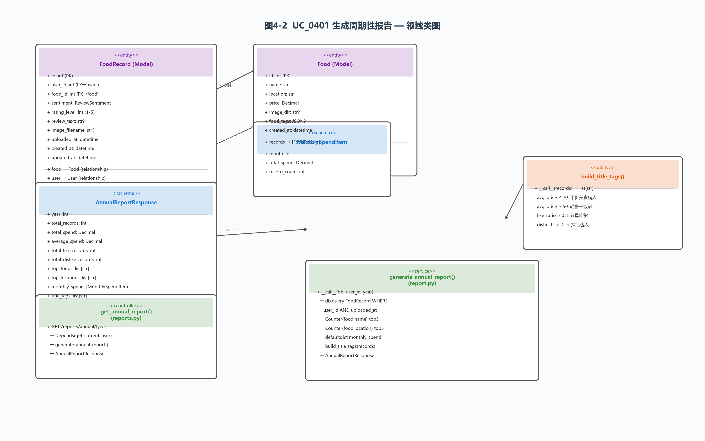

上图完整展示了年度报告生成涉及的全部软件对象及其静态关系。注意 `FoodRecord` 通过 `food` relationship 延迟加载 `Food` 对象——一次查询 + N 次隐式 JOIN，在 Python 内存中完成全部聚合计算，避免在 SQL 层写复杂的 GROUP BY + 多表 JOIN 语句。

**5、数据表参与说明**

报告生成涉及的两张核心数据表及关联关系参见以下 ER 图：

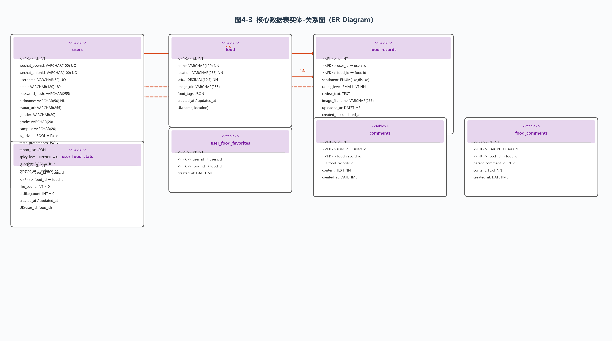

ER 图中展示了 `food_records` 与 `users`、`food` 的外键关联，以及 `user_food_stats`、`user_food_favorites`、`comments`、`food_comments` 等辅助表的关系网。

---

## 五、技术附录（沿用前序章节）

本章第 4 节静态结构设计覆盖了 2 个核心用例（UC_0101 用户注册与登录、UC_0401 周期性报告生成）共 5 条指令的完整静态设计。每条指令均给出了：参与对象的静态结构表、UML 类图（标注 Stereotype）、属性清单、方法签名、类间关联关系描述。同时提供了核心数据表的 ER 关系图，展示各实体间的外键关联和 1:N 映射关系。
